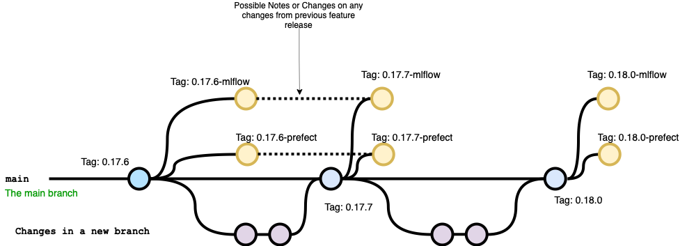

# sf_reference

Planned Branching Strategy

Main Branch --> Updated to latest kedro version without any integration eg mlflow or prefect or airflow

Tag for each version of kedro eg: 0.17.6, 0.17.7, 0.18.0

Feature Branches and tags with integrations. These could also be just explorations if and possibly without any tagging.

The image below shows how I plan to add tags.

## List of Releases

1. [v0.17.6](https://github.com/avan-sh/spaceflight_reference/tree/v0.17.6). Based on auto created project from 0.17.6

# Notes 

## V0.17.6 Prefect
1. 

## V0.17.7
1. Add name spacing to both data processing & data science pipelines
2. Two sub pipelines in data science pipelines

